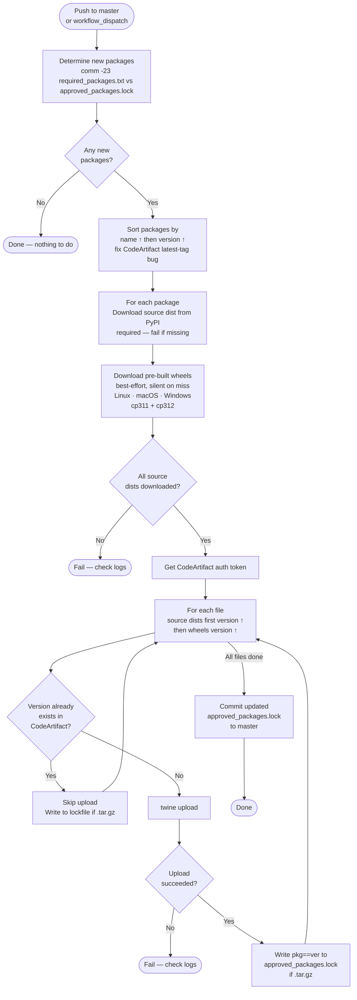
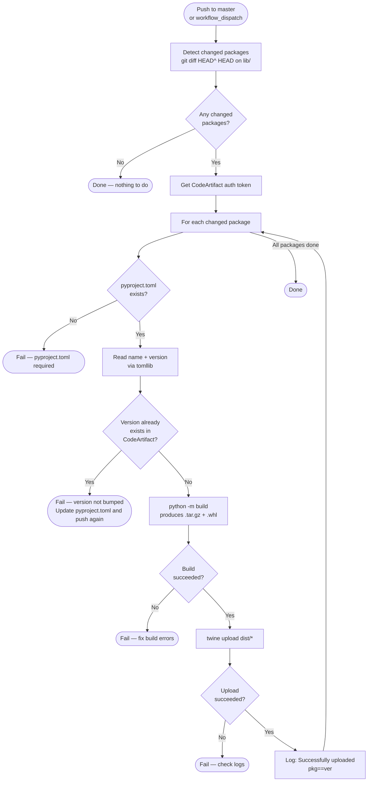

# Approved Packages

A mono-repo that acts as the single source of truth for all Python packages available in the company's private AWS CodeArtifact PyPI repository. It handles two categories of packages:

1. **Public packages** — third-party packages from PyPI vetted and approved by the security team
2. **Custom packages** — internal libraries built by the team and published from this repo

All developers install packages exclusively from the private CodeArtifact repo, never directly from public PyPI.

---

## Repository Structure

```
approved-packages/
├── .github/workflows/
│   ├── push-repos-to-ca.yaml        # Uploads public packages to CodeArtifact
│   └── push-custom-packages.yaml    # Builds and uploads custom packages to CodeArtifact
├── lib/
│   └── <package-name>/              # One directory per custom package
│       ├── pyproject.toml           # Package metadata (name, version, deps)
│       └── src/
│           └── <package_name>/
│               └── __init__.py
├── required_packages.txt            # Approved public packages (package==version)
└── approved_packages.lock           # Auto-generated: tracks what's been uploaded
```

---

## How to Add a Public Package

1. Get the package and exact version approved by the security team.
2. Add an entry to `required_packages.txt` in the format `package-name==version`:
   ```
   requests==2.32.5
   ```
3. Push to `master`. The `Upload Public Packages` workflow triggers automatically.

**Rules:**
- Only `package==version` format is accepted. Ranges (`>=`, `~=`) are not allowed.
- The workflow only processes entries not already in `approved_packages.lock`.
- Both source distributions and pre-built wheels (for Linux, macOS, Windows × Python 3.11 and 3.12) are uploaded, so consumers never face missing wheel errors.
- `approved_packages.lock` is committed back automatically after a successful upload.

---

## How to Add or Update a Custom Package

### Creating a new package

1. Create a directory under `lib/` following the structure:
   ```
   lib/
   └── my-package/
       ├── pyproject.toml
       └── src/
           └── my_package/
               └── __init__.py
   ```
2. Define metadata in `pyproject.toml`:
   ```toml
   [build-system]
   requires = ["setuptools>=68"]
   build-backend = "setuptools.backends.legacy:build"

   [project]
   name = "my-package"
   version = "0.1.0"
   description = "What this package does"
   requires-python = ">=3.11"
   dependencies = []

   [tool.setuptools.packages.find]
   where = ["src"]
   ```
3. Push to `master`. The `Build and Upload Custom Packages` workflow triggers automatically.

### Updating an existing package

1. Make your code changes under `lib/<package-name>/`.
2. **Bump the version** in `pyproject.toml` — the workflow will fail if the version already exists in CodeArtifact.
3. Push to `master`.

---

## GitHub Secrets Required

| Secret | Description |
|---|---|
| `AWS_ACCESS_KEY_ID` | AWS IAM access key with CodeArtifact publish permissions |
| `AWS_SECRET_ACCESS_KEY` | AWS IAM secret key |
| `DOMAIN_NAME` | CodeArtifact domain name |
| `REPO_NAME` | CodeArtifact repository name |

---

## Workflows

### Public Packages — `push-repos-to-ca.yaml`

Triggered on push to `master` when `required_packages.txt` changes, or manually via `workflow_dispatch`.



### Custom Packages — `push-custom-packages.yaml`

Triggered on push to `master` when any file under `lib/` changes, or manually via `workflow_dispatch`.



---

## Key Design Decisions

**Version-ascending upload order** — CodeArtifact marks the most recently uploaded version as "latest", not the highest semantic version. By sorting packages by name then version ascending before uploading, the highest version is always uploaded last and correctly receives the "latest" tag.

**Source dist + platform wheels** — Source distributions are always required (universal fallback for any platform). Pre-built wheels are downloaded on a best-effort basis for `manylinux2014_x86_64`, `manylinux2014_aarch64`, `macosx_11_0_arm64`, `macosx_10_9_x86_64`, and `win_amd64` targets for both Python 3.11 and 3.12, so consumers get fast installs without compilation.

**Lockfile as the gate** — `approved_packages.lock` tracks every public package version successfully uploaded. On each run, only entries in `required_packages.txt` that are absent from the lockfile are processed, preventing redundant re-uploads.

**Version bump enforcement** — Custom package uploads are blocked if the version in `pyproject.toml` already exists in CodeArtifact. This ensures every change to a library results in a new, traceable version.

**Concurrency groups** — Each workflow uses a dedicated concurrency group (`codeartifact-lockfile`, `codeartifact-custom`) with `cancel-in-progress: false`. Concurrent runs queue rather than cancel, preventing race conditions on the lockfile and avoiding lost uploads.
